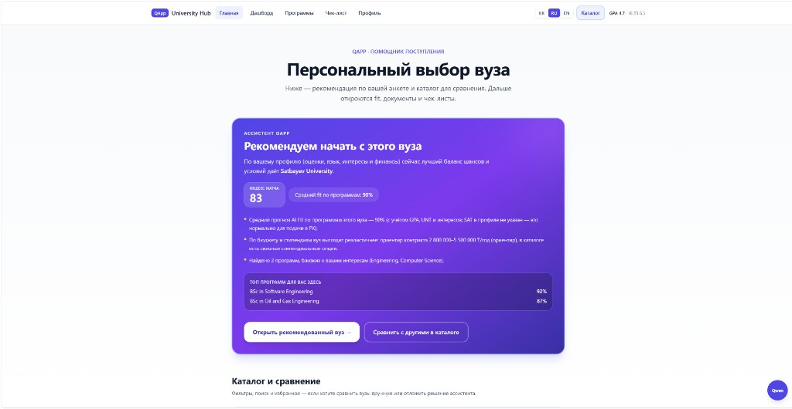
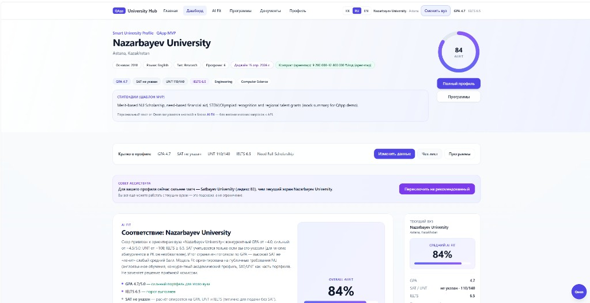

# Smart University Profile · QApp MVP

**Impact Admissions × QApp Hackathon · версия ТЗ 1.0 (2026)**  
Команда **16** · репозиторий: [github.com/markboris101-coder/QApp-hakaton-team-16](https://github.com/markboris101-coder/QApp-hakaton-team-16)

Исходное техническое задание: файл **`QApp_Техническое направление.docx`** в корне репозитория; текстовая копия для поиска: **`docs/QApp_TZ_plain_utf8.txt`**.

Ниже README структурирован по **разделу 13 ТЗ** (обязательные 10 пунктов).

---

## 1. Project overview — что это и зачем

**Smart University Profile** — умная страница профиля университета в экосистеме **QApp**: не статическая карточка вуза, а персональный **admissions advisor** в браузере. Прототип показывает абитуриенту на основе его профиля **совместимость (AI Fit)**, релевантные программы, документы и дедлайны, стипендии и подсказки **Qwen** (через OpenRouter или прокси на сервере).

---

## 2. Problem statement — какую проблему решает

Формулировки — из **§3 ТЗ**; напротив каждой — как прототип **Smart University Profile** на неё отвечает.

| Проблема (§3 ТЗ) | Как закрываем в продукте |
|------------------|---------------------------|
| Информация «сухая» — непонятно, **что делать дальше** | Дашборд, **сайдбар** с шагами, **Qwen**-обзоры по запросу, CTA и ссылки на программы / документы; анкета на лендинге ведёт к персональному сценарию. |
| **Нет персонализации** программ под интересы | **Профиль** (интересы, GPA, UNT, язык) → **`calculateFitScore`**, пересчёт match reason, **ProgramGrid** с фильтрами; **каталог вузов** + рекомендация «топ вуз». |
| Документы и дедлайны **не в action plan** | **AdmissionChecklist** (статусы, прогресс) + **DeadlinesTimeline** (шаги до дедлайна) + предупреждения (например, медсправка). |
| **Нет ощущения умного помощника** | **AiFitCard**, **QwenAssistantDock**, разбор стипендий и достижений текстом → уровни; подсказки привязаны к профилю. |
| Мало **интерактивности** (фильтры, прогресс, чек-листы) | Фильтры в **ProgramGrid** и **UniversitySearchPanel**, прогресс в чек-листе, шорт-лист программ, избранные вузы, переключатель языка. |
| Непонятно: **мои ли программы, успею ли, что загрузить** | Процент **fit** на карточках, **english warning**, таймлайн и дедлайн, чек-лист с **Upload** / статусами, AI-текст по кнопке. |
| **Нет иерархии** важного | Сверху **hero + fit**; критичное (дедлайн, missing docs) **выделено** в таймлайне и чек-листе; сайдбар дублирует краткий итог. |

Полностью «вылечить» пассивность маркетинговой страницы QApp вне этого репозитория нельзя — в ТЗ требуется **отдельный интерактивный прототип страницы вуза**, и перечисленное выше — его содержание по задаче.

---

## 3. Solution — как именно решает

- **Профиль студента** (анкета на лендинге + редактирование в `/profile`) задаёт GPA, языки, UNT/SAT, город, финансирование, интересы; опционально — **текст достижений**, который модель переводит в уровни бонусов.
- **`calculateFitScore`** и **`getUniversityRecommendations`** персонализируют программы и рекомендации вузов.
- **Чек-лист документов** и **deadlines timeline** визуализируют готовность и сроки; стипендии и AI Fit используют данные профиля и вызовы LLM по действию пользователя (без автоспама API).
- **Мультиязычный UI** (қазақша / русский / English) через `i18next`.
- Опционально: **Express** (`server/`) — сохранение профиля, список вузов, прокси **`/api/ai/chat`** для безопасного ключа в проде.

Семь вопросов из **§4 ТЗ** покрываются совокупностью дашборда, сайдбара, чек-листа, таймлайна, каталога и ИИ-блоков (fit, чат Qwen, обзоры).

---

## 4. Features — список реализованных функций

**Обязательный MVP по §6 ТЗ**

| Функция | Реализация |
|--------|------------|
| Адаптивная страница профиля / дашборд | ✅ Tailwind, mobile + desktop |
| Hero: вуз, город, фон, бейджи, CTA | ✅ `HomePage` / hero-блоки |
| Блок AI Fit / Your Match | ✅ `AiFitCard`, кольцо/процент, обзор Qwen по кнопке |
| Программы: поиск и фильтры | ✅ `ProgramGrid` |
| Admission checklist + прогресс | ✅ `AdmissionChecklist`, статусы READY / MISSING / PENDING |
| Deadlines timeline | ✅ `DeadlinesTimeline`, вертикальная шкала + предупреждения |
| Стипендии + AI-инсайт | ✅ `ScholarshipsSection` |
| Sticky sidebar (desktop) | ✅ `DashboardStickySidebar` |
| Профиль студента | ✅ mock + IndexedDB + опционально `PUT /api/profile` |
| Персонализация | ✅ fit, рекомендации вузов, достижения |
| Современный UI | ✅ React + Tailwind |

**Сверх MVP (улучшения)**

- Backend профиля и прокси ИИ · загрузка файлов в IndexedDB · несколько вузов в мок-каталоге · **Qwen** для чата, обзоров и разбора достижений · локализация **kk / ru / en** · каталог с поиском и сравнением вузов · избранное программ и вузов · страница **`/blog`** (демо-статьи, поиск и теги) · демо-**аналитика воронки** в `localStorage` (панель внизу профиля) · улучшенная **доступность** модалок (фокус, `aria-*`, Tab-цикл в чате).

---

## 5. Tech stack — чем сделано

| Слой | Технологии |
|------|------------|
| Frontend | React 18, Vite 5, React Router, Tailwind CSS, Framer Motion |
| i18n | `i18next`, `react-i18next` |
| ИИ | OpenAI-compatible API (OpenRouter: Qwen 2.5, Qwen2.5-VL для vision) |
| Хранение | `localStorage`, IndexedDB (`src/lib/documentStorage.ts`), опционально `server/data/profile.json` |
| Backend (опционально) | Node.js, Express (`server/`) |

---

## 6. How to run — инструкция запуска проекта

**Только фронтенд**

```bash
npm install
cp .env.example .env.local   # Windows: copy .env.example .env.local
# При необходимости укажите VITE_API_KEY для ИИ из браузера
npm run dev
```

Откройте `http://localhost:5173`.

**Фронт + API локально**

```bash
npm run dev:full
```

или отдельно: `npm run dev:server` (порт **8787**) и `npm run dev` (Vite проксирует `/api`).

**Production-сборка**

```bash
npm run build
npm run preview
```

**Переменные окружения (фронт)**

| Переменная | Назначение |
|------------|------------|
| `VITE_API_KEY` | Прямой вызов LLM из браузера; нужен для vision (PNG), если не прокси |
| `VITE_OPENROUTER_API_KEY` | Альтернативное имя ключа |
| `VITE_AI_BASE_URL`, `VITE_AI_MODEL`, `VITE_AI_VISION_MODEL` | Endpoint и модели |
| `VITE_API_BASE_URL` | URL бэкенда без завершающего `/` |
| `VITE_USE_AI_PROXY` | `true` — чат и текстовый ИИ через `POST /api/ai/chat`, ключ на сервере |

Подробности деплоя: **[DEPLOY.md](./DEPLOY.md)** (`vercel.json`, `netlify.toml`, health-check `GET /api/health`).

---

## 7. Data explanation — откуда данные

- **Университеты и программы** — JSON в **`src/catalog/universities/`** (сборка в `universities.bundle.json` командой **`npm run catalog:bundle`**); типы и студент по умолчанию в **`src/mockData.ts`**. Доп. факультеты подмешиваются из **`src/data/universityDatabase/extraFaculties.ts`**. Это демо-контент, не официальные прайсы или правила приёма.
- **Профиль студента** — по умолчанию из **§8 ТЗ** (GPA 4.7, IELTS 7.0 и т.д. в `currentStudent`), перезапись через формы; персистенция в **IndexedDB** и опционально на сервере через API.
- **ИИ** — ответы генерирует внешняя модель (Qwen) по данным профиля и вуза; без ключа часть функций показывает подсказки или эвристику.
- **Блог** — тексты в **`src/locales/*.json`** под ключами `blog.*`; порядок и метаданные статей (теги, время чтения) в **`src/data/blogPosts.ts`**.

---

## 8. Screenshots — скриншоты интерфейса

Имена и порядок — см. **`docs/screenshots/README.md`**. Снимите после `npm run dev`, положите PNG в **`docs/screenshots/`**, затем закоммитьте.

| Файл | Что показать |
|------|----------------|
| `landing.png` | Лендинг / анкета |
| `dashboard.png` | Дашборд вуза (AI Fit + программы) |
| `profile.png` *(опционально)* | Страница профиля или каталог |
| `blog.png` *(опционально)* | `/blog` — поиск, теги, статьи |

После добавления файлов можно вставить в README превью, например:

```markdown


```

---

## 9. Limitations — что не реализовано или отличается от формулировок ТЗ

Соблюдены ограничения **§7 ТЗ** (нет оплаты, нет admin panel, нет скрапинга).

Интерфейс по **§10 ТЗ** (блоки A–K) закрыт в прототипе: платформенная навигация и CTA «Apply to …», двуязычное название вуза в hero, AI-инсайт и бейдж AI Match, блок AI Fit со статусами **Strong Match / Qualified / Partial Match / Low Match**, списками «почему подходит», gaps и пронумерованными шагами, фильтр **Fit score** в сетке программ с сортировкой по fit по умолчанию, кнопки «View requirements» и шорт-лист на карточках, блок сравнения с другими вузами, расширенный sticky sidebar (и та же карточка на mobile), футер с разделами платформы и Legal / My Applications / Saved / Settings (ссылки на якоря и профиль; Privacy/Terms — заглушки `#` для демо). Раздел **Blog**: маршрут **`/blog`** — демо-статьи (kk / ru / en), поиск по тексту, фильтр по тегам, оглавление, CTA на чек-лист и сетку программ.

**Сдача по §12:** PDF/слайды (5–10), видео-демо, продакшен-URL — **вне репозитория**, подготавливаются командой отдельно.

---

## 10. Future improvements — что можно добавить в продакшне

Из **§16 ТЗ** и здравого смысла:

- расширенная **база вузов** и синхронизация с официальными источниками;
- **трекинг заявок** и учётные записи;
- полноценное **сравнение 2–4 вузов** в одном view;
- уведомления о дедлайнах (email / push);
- **PWA** или мобильное приложение;
- полный **footer** и выравнивание навбара с продуктовой навигацией QApp;
- скриншоты в `docs/screenshots/` и актуальная **deploy**-ссылка в README для жюри (например Vercel после публикации).

---

### Приложение: соответствие MVP (§6 ТЗ)

Все обязательные пункты §6 закрыты прототипом; опциональные из §6 (backend, файлы, несколько вузов, ИИ) — частично или полностью реализованы (см. таблицы выше).

### Приложение: критерии жюри (§14)

Проект ориентирован на трассировку: полезность абитуриенту, персонализация fit и рекомендаций, устойчивый MVP, возможность показать слайды и ответить на вопросы по архитектуре и данным.

---

*Демонстрационный прототип; юридически значимые решения о поступлении необходимо принимать по официальным источникам вузов.*
