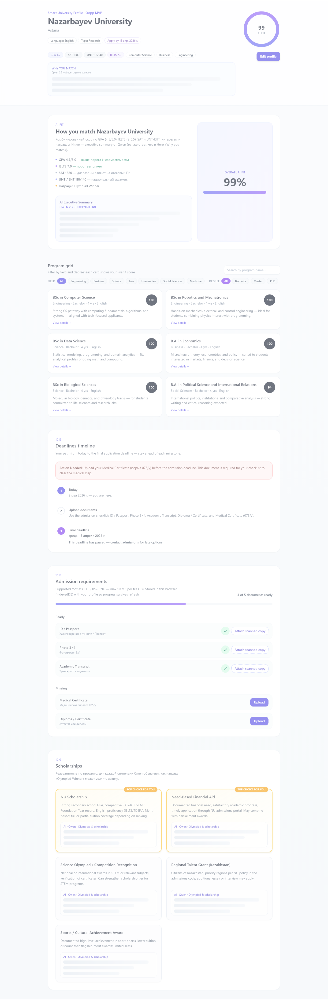

# Smart University Profile · QApp MVP

Умная студенческая карточка для QApp: подбор программ, дедлайны, чек-лист документов и советы от модели (OpenRouter / Qwen).

## Интерфейс

Ниже — скриншот того же UI, что вы видите локально после **`npm run dev`** (стили совпадают с production-сборкой `npm run preview`).



## Запуск локально

```bash
npm install
```

Создайте файл `.env.local` по образцу `.env.example` и укажите `VITE_API_KEY` для OpenRouter (или другого совместимого провайдера).

```bash
npm run dev
```

Откройте в браузере адрес из терминала (обычно `http://localhost:5173`).

## Сборка

```bash
npm run build
npm run preview
```
